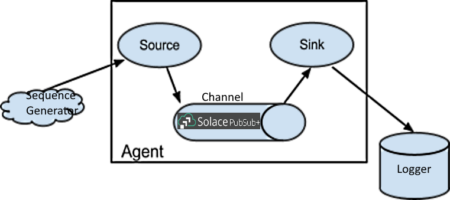
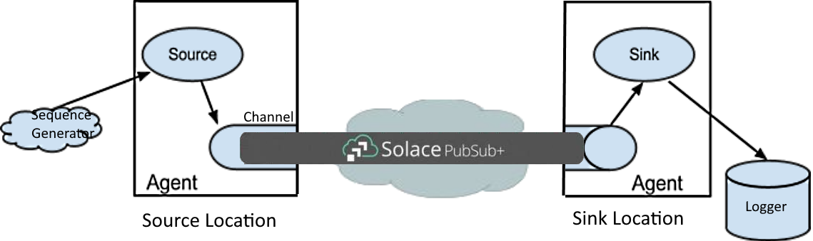
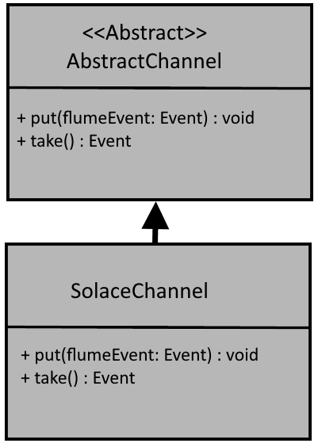
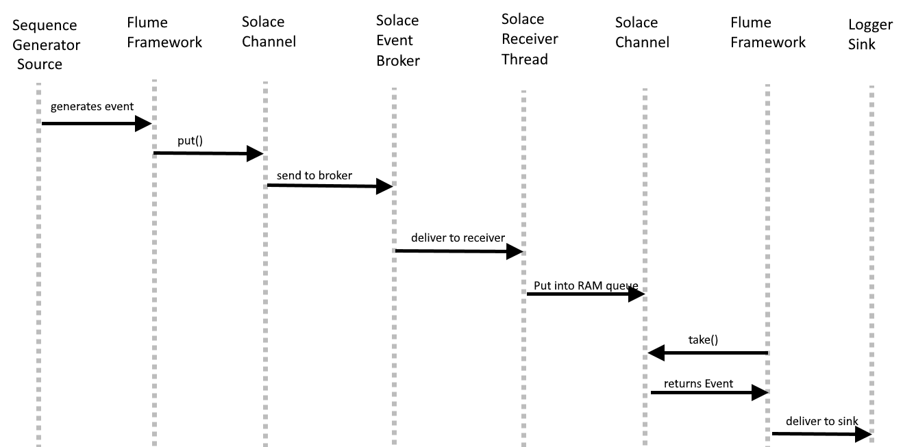

# The Solace Apache Flume Channel

## Overview

Apache Flume is a distributed, reliable, and available software for efficiently collecting, aggregating, and moving large amounts of log data. It has a simple and flexible architecture based on streaming data flows. It is robust and fault tolerant with tunable reliability mechanisms and many failover and recovery mechanisms. It uses a simple extensible data model that allows for online analytic application.

To learn more about Flume, click [here](https://flume.apache.org/ "here").

This project builds an Apache Flume channel using a Solace event broker as the channel medium. A sample config file is provided that uses a Sequence generator as the source and the logger sink to demostrate the Solace channel in action.

The provided build script generates a single jarfile which you copy into your Apache Flume runtime environment.


## Table of contents
* [Synopsis](#synopsis)
* [Design](#design)
* [Usage](#usage)
* [Sample Walkthrough](#sample-walkthrough)
* [Contributing](#contributing)
* [Authors](#authors)
* [License](#license)
* [Resources](#resources)
---

## Synopsis

Consider the following diagram:



The Apache provided Sequence Generator source is used for simplicity. It generates Flume events with a simple sequence number for the payload.

Inside the Solace channel, the message is converted from a Flume event into a Solace message. The From there, the  message is pushed into a Solace Queue on a broker/VPN specified in the Flume configuration file. For this sample, the message is Solace's own SMF format, but it could just have easily been sent using a REST POST, AMQP or MQTT.

In this sample, the source and sink are both run in the context of the same local Flume instance. If your use case requires the sink and source be located on different servers or even spread across geographical regions, you would use an instance of Flume at each location, and implement one end of the stream on each, as show in the diagram below:



## Design

The design of the Solace Flume channel is quite simple, implementing a channel as mandated by the Flume architecture, by subclassing from AbstractChannel and implementing the following methods:

put(Event flumeEvent)
Event take()



In the following sequence diagram, we can observe the interaction between the components and classes comprising this solution:



First, and event is generated by the Sequence Generator source and pushed into the Flume framework. Next, Flume calls the Solace channel's put() method, passing the event in. The Solace channel then converts the Flume event into a Solace message, and sends it to the configured Solace event broker queue. 

On the other end of the flow we have a Solace message receiver thread, bound to the the configured Solace event broker queue where it is awaiting messages. It receives the message from the underlying Solace API, converts it back to a Flume Event object, and puts in into an internal RAM queue inside the Solace channel, where it is accesible to the main execution thread.

Finally, at a subsequent time, the Flume framework calls the Solace's channel's take() method. If an Event is available in the internal RAM queue, it is return to teh Flume framework, which passes it on to the logger sink.

## Usage

This sample comes with a build script for Gradle. Build the library, deploy it into your Flume runtime and run teh sample. The following steps will show you how to do this.

#### Build with Gradle
```groovy
//Just call the included build script/batch file that uses the gradle wrapper from  your OS command line:
> gradlew build assemble
```
Once the build is completed, you will find the solace-flume-channel.jar file in your build/libs directory

#### Deploy into your Flume runtime

Simply copy the solace-flume-channel.jar file into your Apache Flmue runtime lib sub-directory where Flume will automatically incude it into the Java classpath.

### Configure your flow

To learn more about configuring Flume, click [here](https://flume.apache.org/FlumeUserGuide.html#configuration "here").

A sample Flume configuration file is found in the config directory of the Solace-flume-channel source tree, called sequenceToLogsThroughSolace.conf. This sample file is setup to use the Sequence Generator source, the Solace channel (with required configuration) and the logger sink.

| Parameter name  | Value  | Description   |
| ------------ | ------------ | ------------ |
| channel type  | com.solace.flume.channel.SolaceChannel  | Identifies the Java class implementing the channel. This class must be found on the classpath.  |
| transactionCapacity  | 100  | The desired size of transactions  |
| hostRouter  | *ip address*   | The hostname or IP address of your Solace event broker  |
| VPN  | default  | The name of the message VPN on the Solace event broker to connect to  |
| clientUserName  | default  | The Solace client username to connect with  |
| Password  | default  | The Solace client username to connect with  |
| QueueName  | flumeQ  | The name of the Solace queue to create and use for sending a receiving messages  |


## Sample Walkthrough

### Acquire a Solace PubSub+ Service

To run this sample you will need a Solace PubSub+ Event Broker.
Here are two ways to quickly get started if you don't already have a PubSub+ instance:

1. Get a free Solace PubSub+ event broker cloud instance
    * Visit https://solace.com/products/event-broker/cloud/
    * Create an account and instance for free
1. Run the Solace PubSub+ event broker locally
    * Visit https://solace.com/downloads/
    * A variety of download options are available to run the software locally
    * Follow the instructions for whatever download option you choose

### Run a Sample

Assuming you are using the Flume configuration file provided in this sample, run Flume, passing in the configuration file, by running this from your OS command line:

```groovy
./bin/flume-ng agent --conf conf --conf-file conf/sequenceToLogsThroughSolace.conf --name a1 
```

### See output in the Flume Logs

Check the logs directory of your Flume installation and see the file "flume.log". In this file, you will see lines similar to the following line for each Event that is sent through the flow. 

	Line 7814: 02 Dec 2020 13:38:25,215 INFO  [SinkRunner-PollingRunner-DefaultSinkProcessor] (org.apache.flume.sink.LoggerSink.process:94)  - Event: { headers:{} body: 36 31                                           61 }
	

If you increase the logging level to DEBUG level, you will also see many messages from tghe Solace channel as it moves the Events through the flow:

	02 Dec 2020 13:38:25,224 INFO  [PollableSourceRunner-SequenceGeneratorSource-SeqSource] (com.solace.flume.channel.SolaceChannel.put:86)  - Event has been put
	

	02 Dec 2020 13:38:25,224 DEBUG [PollableSourceRunner-SequenceGeneratorSource-SeqSource] (com.solacesystems.jcsmp.impl.JCSMPXMLMessageProducer.sendImpl:715)  - About to send message
	

And then as messages come back in on the consuming side:

	Line 7794: 02 Dec 2020 13:38:25,213 INFO  [SinkRunner-PollingRunner-DefaultSinkProcessor] (com.solace.flume.channel.SolaceChannel.take:127)  - take() is called
	

	Line 7810: 02 Dec 2020 13:38:25,214 INFO  [SinkRunner-PollingRunner-DefaultSinkProcessor] (com.solace.flume.channel.SolaceChannel.take:158)  - About to convert the solace message to a flume message
	

	Line 7796: 02 Dec 2020 13:38:25,213 INFO  [SinkRunner-PollingRunner-DefaultSinkProcessor] 	(com.solace.flume.channel.SolaceChannel.take:161)  - Converted the solace message to a flume message successfully
	
## Contributing

Please read [CONTRIBUTING.md](CONTRIBUTING.md) for details on our code of conduct, and the process for submitting pull requests to us.

## Authors

Mike O`Brien/mike.obrien@solace.com

## License

This project is licensed under the Apache License, Version 2.0. - See the [LICENSE](LICENSE) file for details.

## Resources

For more information about Solace technology in general please visit these resources:

- The [Solace Developers website](https://www.solace.dev/)
- Understanding [Solace technology]( https://solace.com/products/tech/)
- Ask the [Solace Community]( https://solace.community/)